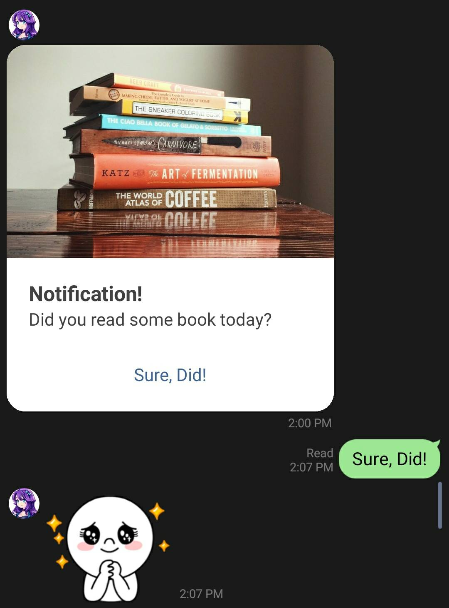

# cron-linebot-docker

A simple linebot serve as a notification. I built this for personal purpose. to notified me to do some task based on cron jobs. this project is configure to be able to automatically test with TravisCI and deployed with Cloud Build which deployed using Cloud Run.

## Software Stack

- Node.js
- That's it!

## Contributing
I don't know just fork it and contact me or something. I'm welcome to help if you need to use this project for your need. :-D

## Screenshot
Notification

</img> 

Quotes

</img> 

## License
[MIT](https://choosealicense.com/licenses/mit/)